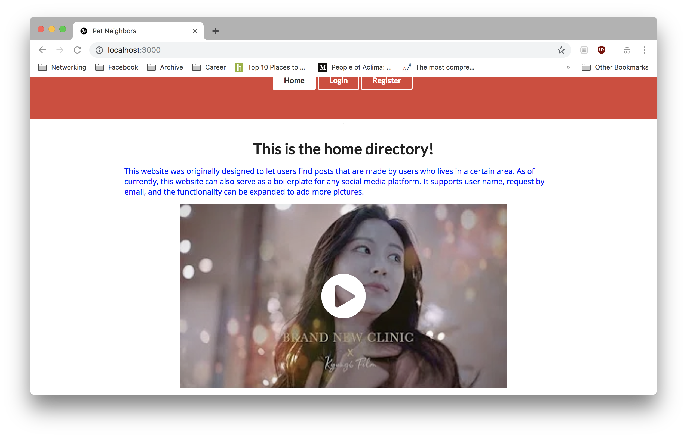
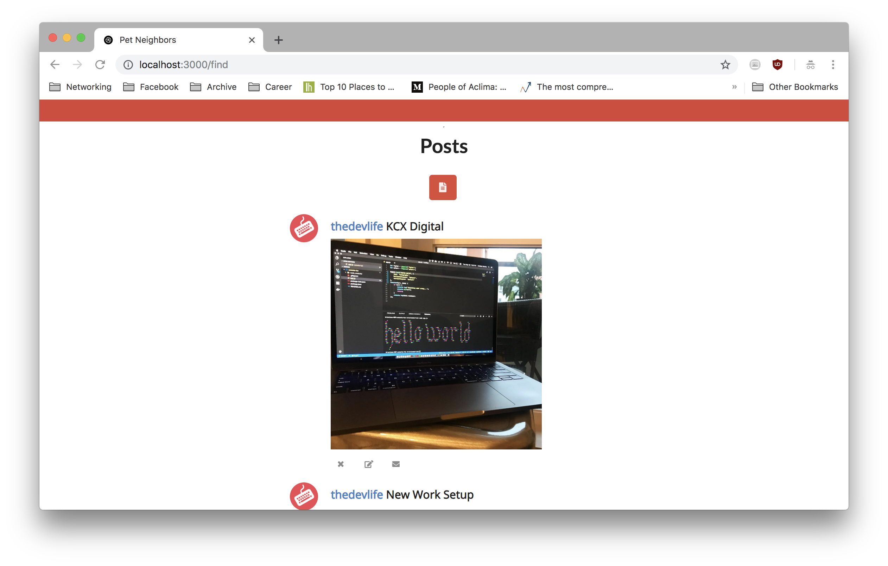
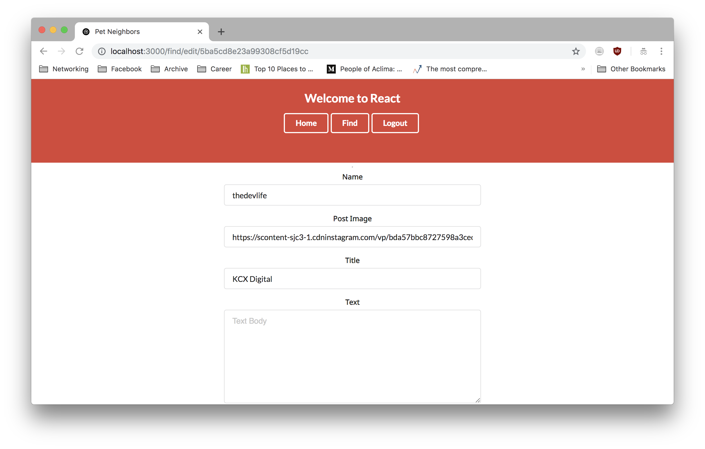
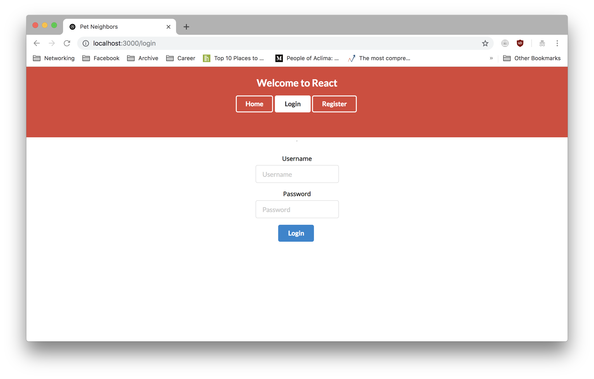
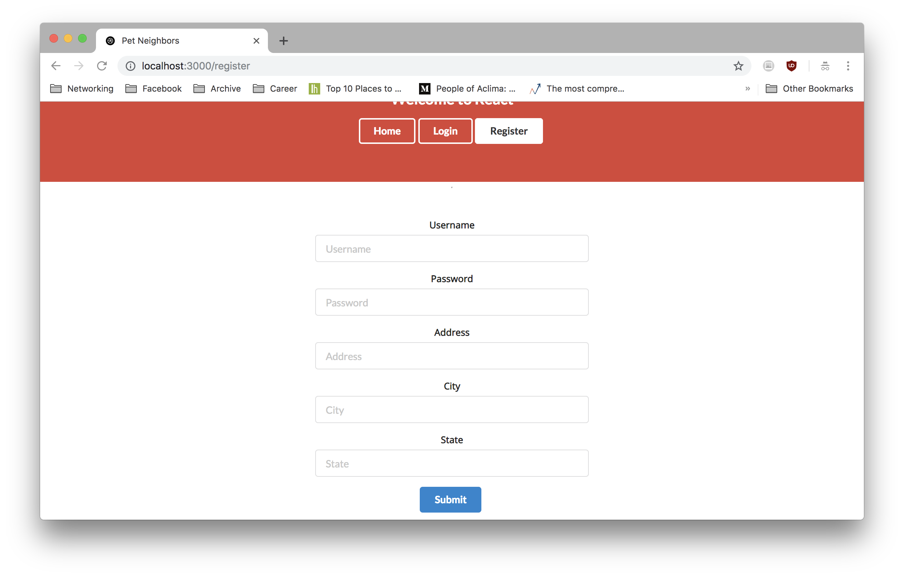

# React Map

This is a boiler plate post application. This servers as a concept boilerplate for any other posting platforms.

## Functionality

Users can:

-   Register and Login
-   View/Add/Edit/Delete Posts
-   Email the poster

In the backend, the server only returns posts in the same city as the registered user.

## Technologies Used

-   MongoDB
-   Node (Express JS)
-   React
-   Semantic-Ui

## Screenshots

### Home



### Post



### Edit Post



### Login



### Register



## Installation

Run the following commands. Clone the directory.

```sh
cd client
npm install
npm start
```

Open a separate terminal in the same directory

```sh
cd server
npm install
npm start
```

Then open two different terminals and change directory
